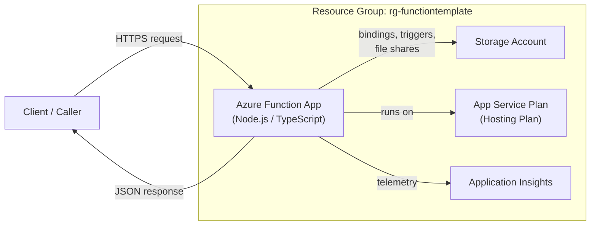
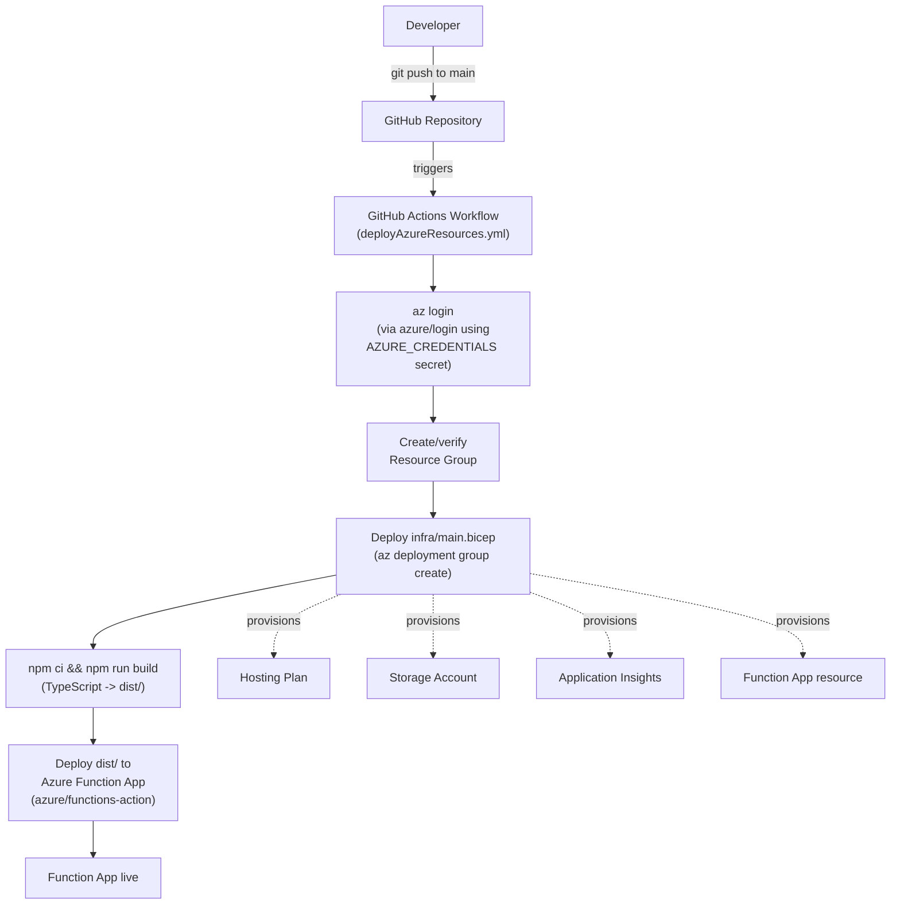
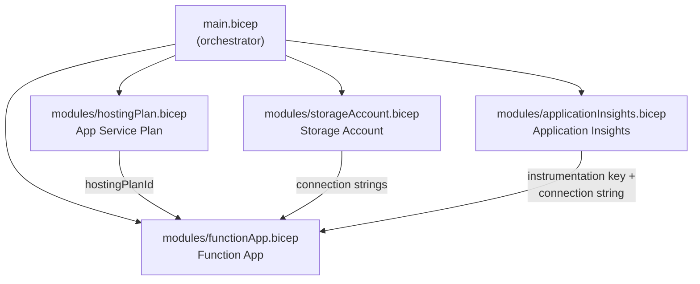
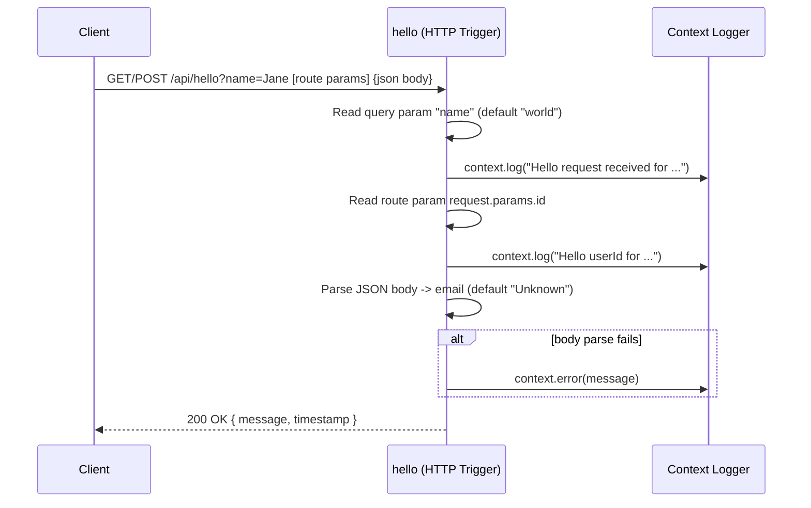
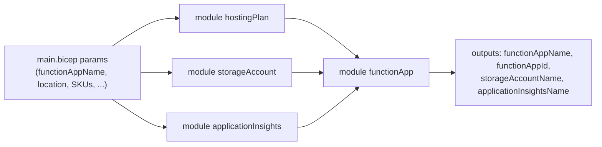
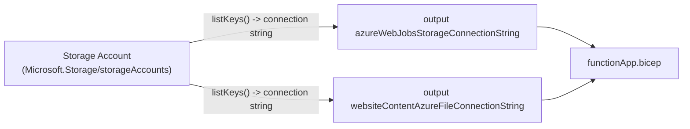
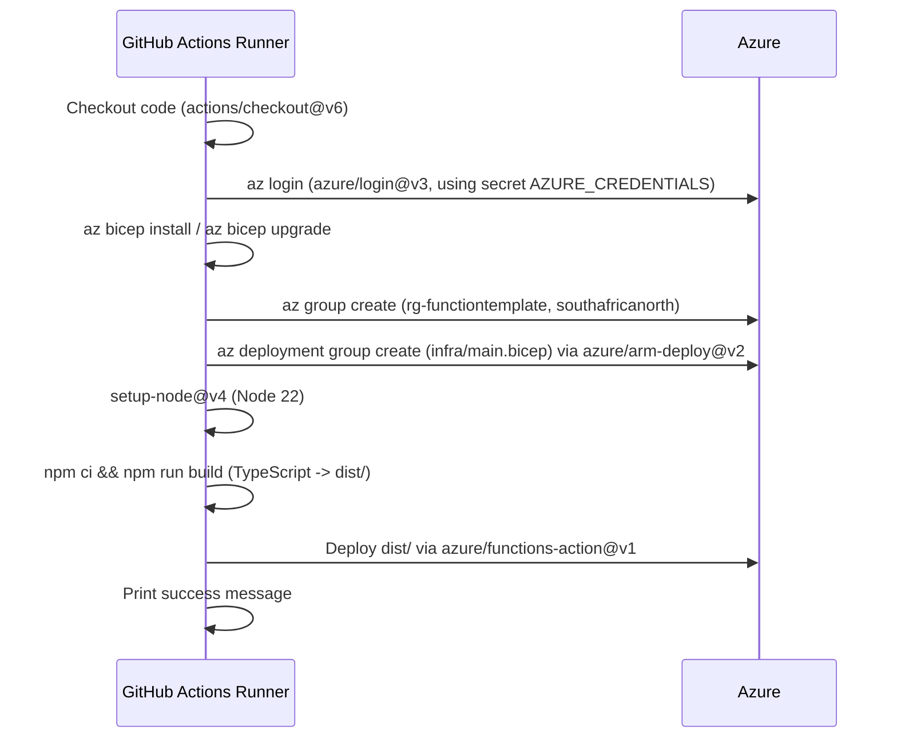
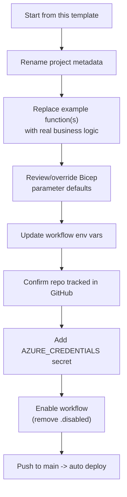

# Azure Cloud Function Template

A reusable starter template for building **Azure Functions** on the Node.js v4 programming model, written in **TypeScript**, provisioned entirely with **Bicep** Infrastructure as Code, and deployed via a **GitHub Actions** pipeline.

This repository is intended to be **cloned/forked per project** — each new Azure Function app (regardless of its business purpose) starts from this template so that infrastructure, build tooling, and CI/CD are consistent across all Spitfire Inbound Azure Function projects.

> **Status note:** This is a *template*, not a finished, deployable solution. All four Bicep modules (`infra/main.bicep` plus `infra/modules/*.bicep`) are now fully authored and wired together — see [Infrastructure as Code](#infrastructure-as-code) for the full parameter/variable/output reference. The GitHub Actions workflow is still intentionally disabled (`.disabled` suffix) until a project is ready to deploy — see [CI/CD Pipeline](#cicd-pipeline).

---

## Table of Contents

- [Overview](#overview)
- [Architecture](#architecture)
- [Repository Structure](#repository-structure)
- [The Azure Function](#the-azure-function)
- [Infrastructure as Code](#infrastructure-as-code)
  - [`main.bicep` (orchestrator)](#mainbicep-orchestrator)
  - [`modules/hostingPlan.bicep`](#moduleshostingplanbicep)
  - [`modules/storageAccount.bicep`](#modulesstorageaccountbicep)
  - [`modules/applicationInsights.bicep`](#modulesapplicationinsightsbicep)
  - [`modules/functionApp.bicep`](#modulesfunctionappbicep)
- [CI/CD Pipeline](#cicd-pipeline)
- [Local Development](#local-development)
- [Deployment Guide](#deployment-guide)
- [Configuration Reference](#configuration-reference)
- [Using This Template for a New Project](#using-this-template-for-a-new-project)
- [Conventions & Notes](#conventions--notes)

---

## Overview

| Concern | Technology |
|---|---|
| Runtime | Node.js (Azure Functions v4 programming model) |
| Language | TypeScript (compiled to `dist/`) |
| Function package | [`@azure/functions`](https://www.npmjs.com/package/@azure/functions) v4 |
| Hosting | Azure Function App (Consumption/Premium — decided by the hosting plan SKU) |
| Infrastructure as Code | Bicep (modular — one file per resource) |
| CI/CD | GitHub Actions (currently disabled) |
| Observability | Azure Application Insights |
| Region (default) | `southafricanorth` |

The template ships with a single example HTTP-triggered function (`hello`) that demonstrates the three common ways of reading input in an Azure Function: query string parameters, route parameters, and a JSON request body.

---

## Architecture

The high-level idea: a client calls an HTTP endpoint exposed by the Function App. The Function App runs on an App Service (hosting) Plan, stores its runtime state/queues in a Storage Account, and streams logs/metrics to Application Insights.



### Deployment-time architecture



### Bicep module dependency graph

`main.bicep` is the orchestrator that wires the four modules together, deploying `functionApp` last since it consumes the outputs of the other three (see [Infrastructure as Code](#infrastructure-as-code) for the full parameter/variable/output reference).



---

## Repository Structure

```
azure-cloud-function-template/
├── .github/
│   └── workflows/
│       └── deployAzureResources.yml.disabled   # CI/CD pipeline (disabled by default)
├── infra/
│   ├── main.bicep                              # Orchestrator template — params, variables, module wiring, outputs
│   └── modules/
│       ├── hostingPlan.bicep                   # App Service Plan (Consumption/Premium)
│       ├── storageAccount.bicep                # Storage Account
│       ├── applicationInsights.bicep           # Application Insights
│       └── functionApp.bicep                   # The Function App resource itself
├── src/
│   └── functions/
│       └── main.ts                             # Example HTTP-triggered function ("hello")
├── deploy.md                                   # Manual deployment / Azure CLI setup notes
├── host.json                                   # Azure Functions host configuration
├── package.json                                # npm scripts & dependencies
├── tsconfig.json                                # TypeScript compiler configuration
├── .vscode/settings.json                       # Editor settings (TS SDK path)
└── .idea/                                       # JetBrains IDE project files
```

---

## The Azure Function

**File:** `src/functions/main.ts`

The template registers one HTTP trigger named `hello` using the Azure Functions v4 programming model (`app.http(...)`), which registers routes in code rather than via a `function.json` file per function.



Key characteristics:

| Aspect | Detail |
|---|---|
| Trigger name | `hello` |
| HTTP methods | `GET` |
| Auth level | `anonymous` (no function key required — suitable for a template/demo; **tighten this for production**, see [Conventions & Notes](#conventions--notes)) |
| Query params | `?name=` — read via `request.query.get("name")` |
| Route params | `request.params.id` — implies a route like `api/users/{id}`, though the registered route currently defaults to `api/hello` (no `route` override is set in `app.http`) |
| Body | Parsed as JSON via `request.json()`, wrapped in try/catch since the body may be missing/invalid |
| Response | `200` with a `jsonBody` containing a message and an ISO `timestamp` |
| Logging | Uses `InvocationContext.log` / `.error`, which is automatically correlated with Application Insights when configured |

> To add a route parameter like `{id}` to the URL itself (so `request.params.id` is actually populated), add a `route` option to the `app.http` registration, e.g. `route: "hello/{id}"`.

To add more functions to the project, create additional files under `src/functions/` following the same pattern: import `app` from `@azure/functions`, define a handler, and call `app.http(...)` (or `app.timer(...)`, `app.serviceBusQueue(...)`, etc. for other trigger types).

---

## Infrastructure as Code

Infrastructure is defined with **Bicep**, split into small, single-responsibility modules under `infra/modules/`, intended to be composed by `infra/main.bicep`.

### `main.bicep` (orchestrator)

This is the entry point that the CI/CD pipeline (and manual deployments) target: `az deployment group create --template-file infra/main.bicep --parameters functionAppName=<name>`. It declares parameters and variables, instantiates all four modules in dependency order, and exposes outputs.



#### Parameters

Only `functionAppName` is required — every other parameter has a sensible default so the template deploys "out of the box". Parameters with a fixed, known-good set of values are constrained with an `@allowed()` decorator so an invalid value fails fast at deployment time (with a clear error) rather than producing a confusing ARM error deep into the deployment.

| Parameter | Type | Default | Allowed values | Purpose |
|---|---|---|---|---|
| `functionAppName` | `string` | *(required)* | — | Name of the Function App. Drives the derived names of the hosting plan, storage account, and Application Insights instance. Should match `AZURE_FUNCTIOAPP_NAME` in the CI workflow. |
| `location` | `string` | `resourceGroup().location` | — | Azure region for every resource. Left unconstrained since any valid Azure region is acceptable. |
| `hostingPlanSKU` | `string` | `Y1` | `Y1`, `EP1`, `EP2`, `EP3`, `P1V2`, `P1V3` | App Service Plan pricing SKU (Consumption / Premium / Dedicated). |
| `hostingPlanSKUTier` | `string` | `Dynamic` | `Dynamic`, `ElasticPremium`, `PremiumV2`, `PremiumV3` | App Service Plan pricing tier — must correspond to the SKU chosen above. |
| `storageAccountSku` | `string` | `Standard_LRS` | `Standard_LRS`, `Standard_GRS`, `Standard_RAGRS`, `Standard_ZRS`, `Premium_LRS` | Storage account replication SKU. |
| `storageAccountKind` | `string` | `StorageV2` | `Storage`, `StorageV2`, `BlobStorage`, `BlockBlobStorage`, `FileStorage` | Storage account kind. |
| `applicationInsightsKind` | `string` | `web` | `web`, `ios`, `other`, `store`, `java`, `phone`, `android`, `MobileCenter` | Application Insights resource `kind`. |
| `applicationInsightsApplicationType` | `string` | `web` | `web`, `other` | Application Insights `Application_Type` property. |
| `applicationInsightsPublicNetworkAccess` | `string` | `Enabled` | `Enabled`, `Disabled` | Public network access for telemetry ingestion. |
| `applicationInsightsPublicNetworkAccessForQuery` | `string` | `Enabled` | `Enabled`, `Disabled` | Public network access for querying telemetry. |
| `functionAppKind` | `string` | `functionapp` | `functionapp`, `functionapp,linux` | Windows vs. Linux Function App. |
| `nodeVersion` | `string` | `~20` | `~18`, `~20`, `~22` | Node.js runtime version (`siteConfig.nodeVersion`). Keep aligned with `WEBSITE_NODE_DEFAULT_VERSION` in `functionApp.bicep` and the CI workflow's `node-version`. |
| `workerRuntime` | `string` | `node` | `node`, `dotnet`, `dotnet-isolated`, `java`, `powershell`, `python`, `custom` | `FUNCTIONS_WORKER_RUNTIME` app setting. |
| `httpsOnly` | `bool` | `true` | *(boolean — implicitly `true`/`false`)* | Whether the Function App rejects plain HTTP. Should stay `true` for production. |

`functionAppName` and `location` have no `@allowed()` list on purpose: names are arbitrary/user-chosen, and hardcoding a region allowlist would just go stale as Azure adds regions.

#### Variables

Names for the supporting resources are *derived*, not passed in, so callers only ever need to think about one name (`functionAppName`):

| Variable | Value | Purpose |
|---|---|---|
| `hostingPlanName` | `${functionAppName}-plan` | App Service Plan name. |
| `uniqueSuffix` | `uniqueString(resourceGroup().id, functionAppName)` | Deterministic, globally-unique suffix. |
| `storageAccountName` | `take(toLower('st${replace(functionAppName, '-', '')}${uniqueSuffix}'), 24)` | Storage account names must be 3–24 characters, lowercase letters/numbers only — this strips invalid characters from `functionAppName` and appends the unique suffix, then truncates to the 24-character limit. |
| `applicationInsightsName` | `${functionAppName}-appi` | Application Insights instance name. |

#### Outputs

| Output | Source |
|---|---|
| `functionAppName` | `functionApp.outputs.functionAppName` |
| `functionAppId` | `functionApp.outputs.functionAppId` |
| `storageAccountName` | `storageAccount.outputs.storageAccountName` |
| `applicationInsightsName` | `applicationInsights.outputs.applicationInsightsName` |

### `modules/hostingPlan.bicep`

Provisions the **App Service Plan** (`Microsoft.Web/serverfarms`) that hosts the Function App.

| Parameter | Type | Purpose |
|---|---|---|
| `hostingPlanName` | `string` | Name of the plan |
| `location` | `string` | Azure region |
| `hostingPlanSKU` | `string` | SKU name, e.g. `Y1` (Consumption) or `EP1` (Premium) |
| `hostingPlanSKUTier` | `string` | SKU tier, e.g. `Dynamic` or `ElasticPremium` |

**Output:** `hostingPlanId` — consumed by `functionApp.bicep` as `hostingServerFarmId`.

### `modules/storageAccount.bicep`

Provisions the **Storage Account** (`Microsoft.Storage/storageAccounts`) that Azure Functions requires for triggers, bindings, and the file share that stores the deployed function code package.

| Parameter | Type | Purpose |
|---|---|---|
| `storageAccountName` | `string` | Name of the storage account (passed in pre-sanitized by `main.bicep` — see its `storageAccountName` variable). |
| `location` | `string` | Azure region. |
| `storageAccountSku` | `string` | Replication SKU, e.g. `Standard_LRS`. |
| `storageAccountKind` | `string` | Storage account kind, e.g. `StorageV2`. |

Security defaults baked into the resource (not exposed as parameters, since they should always hold): `supportsHttpsTrafficOnly: true`, `minimumTlsVersion: 'TLS1_2'`, `allowBlobPublicAccess: false`.

The module outputs the **same connection string twice**, under the two names the Function App module already expects — both settings point at the one storage account, so there's no reason to compute the string separately for each:



**Outputs:** `storageAccountName`, `azureWebJobsStorageConnectionString` (→ `AzureWebJobsStorage` app setting), `websiteContentAzureFileConnectionString` (→ `WEBSITE_CONTENTAZUREFILECONNECTIONSTRING` app setting).

### `modules/applicationInsights.bicep`

Provisions **Application Insights** (`Microsoft.Insights/components`) for logging, metrics, and distributed tracing.

| Parameter | Type | Purpose |
|---|---|---|
| `applicationInsightsName` | `string` | Resource name |
| `location` | `string` | Azure region |
| `kind` | `string` | e.g. `web` |
| `applicationInsightsApplicationType` | `string` | e.g. `web` |
| `applicationInsightsPublicNetworkAccess` | `string` | Public network access for ingestion (`Enabled`/`Disabled`) |
| `applicationInsightsPublicNetworkAccessForQuery` | `string` | Public network access for querying (`Enabled`/`Disabled`) |

**Outputs:** `applicationInsightsName`, `instrumentationKey`, `connectionString` — the latter two feed the Function App's `APPINSIGHTS_INSTRUMENTATIONKEY` and `APPLICATIONINSIGHTS_CONNECTION_STRING` app settings.

### `modules/functionApp.bicep`

Provisions the **Function App** resource itself (`Microsoft.Web/sites`, kind `functionapp`), wiring together the outputs of the three modules above.

| Parameter | Source |
|---|---|
| `location` | `main.bicep` |
| `functionAppName` | `main.bicep` |
| `functionAppKind` | `main.bicep` (e.g. `functionapp`) |
| `hostingServerFarmId` | ← `hostingPlan.bicep` output |
| `azureWebJobsStorageConnectionString` | ← `storageAccount.bicep` output |
| `websiteContentAzureFileConnectionString` | ← `storageAccount.bicep` output |
| `nodeVersion` | `main.bicep` |
| `appInsightInstrumentationKey` | ← `applicationInsights.bicep` output |
| `appInsightConnectionString` | ← `applicationInsights.bicep` output |
| `workerRuntime` | `main.bicep` (should be `node` for this template) |
| `httpsOnly` | `main.bicep` (recommended: `true`) |

App settings configured on the resulting Function App:

- `AzureWebJobsStorage`
- `WEBSITE_CONTENTAZUREFILECONNECTIONSTRING`
- `WEBSITE_CONTENTSHARE` (lower-cased function app name)
- `FUNCTIONS_EXTENSION_VERSION` = `~4`
- `WEBSITE_NODE_DEFAULT_VERSION` = `~20`
- `APPINSIGHTS_INSTRUMENTATIONKEY`
- `APPLICATIONINSIGHTS_CONNECTION_STRING`
- `FUNCTIONS_WORKER_RUNTIME`

**Outputs:** `functionAppName`, `functionAppId`.

---

## CI/CD Pipeline

**File:** `.github/workflows/deployAzureResources.yml.disabled`

The workflow is **disabled by default** (note the `.disabled` file extension — GitHub Actions only picks up files ending in `.yml`/`.yaml`). This is intentional for a template repository: each downstream project should consciously enable deployment once it's ready to provision real Azure resources.

> Per Spitfire Inbound policy: **only enable/rename this workflow, and upload assets to Azure/HubSpot, for a project that is tracked in GitHub.** This ensures other team members' work isn't overwritten by out-of-band changes.

### Trigger

Runs on every push to the `main` branch.

### Pipeline steps



### Environment variables (workflow-level)

| Variable | Default | Purpose |
|---|---|---|
| `LOCATION` | `southafricanorth` | Azure region for all resources |
| `RESOURCE_GROUP` | `rg-functiontemplate` | Resource group name (rename per project) |
| `AZURE_FUNCTIOAPP_NAME` | `"the function app name"` | **Must be changed** to the real Function App name per project (note: the variable name itself has a typo — `FUNCTIOAPP` — carried over from the template; fine to leave as-is for compatibility, or fix it consistently in one pass if you rename the project) |

### Required secrets

| Secret | Purpose |
|---|---|
| `AZURE_CREDENTIALS` | Service principal credentials JSON used by `azure/login@v3` to authenticate to Azure |

See [Deployment Guide](#deployment-guide) for how to create this secret.

> **Note:** The workflow's `setup-node` step passes `cache: pnpm`, but the project's dependency install step uses `npm ci` and there is no `pnpm-lock.yaml` committed (it's explicitly git-ignored). If pnpm caching isn't actually desired, either commit a `pnpm-lock.yaml` or switch the cache option to `npm`/remove it — otherwise the cache step may be a no-op or fail depending on runner configuration.

---

## Local Development

### Prerequisites

- [Node.js](https://nodejs.org/) (v20+ recommended to match `WEBSITE_NODE_DEFAULT_VERSION`; the CI pipeline builds with Node 22)
- [Azure Functions Core Tools](https://learn.microsoft.com/azure/azure-functions/functions-run-local) (`func`) — required for `npm start`
- npm (the project currently uses `npm ci`/`npm run build`, despite the CI workflow's stray `cache: pnpm` hint)

### Setup

```bash
npm install
```

### Build

Compiles TypeScript from `src/` to `dist/` per `tsconfig.json`:

```bash
npm run build
```

Watch mode (recompiles on save):

```bash
npm run watch
```

### Run locally

`npm start` automatically builds first (`prestart` hook) and then starts the Functions host:

```bash
npm start
```

By default this exposes the function at:

```
http://localhost:7071/api/hello
```

Try it:

```bash
curl "http://localhost:7071/api/hello?name=Johann"
curl -X GET "http://localhost:7071/api/hello?name=Johann" -H "Content-Type: application/json" -d '{"email":"johann@spitfireinbound.com"}'
```

### Tests

`npm test` is currently a placeholder (`echo "No tests specified" && exit 0`). Add a real test runner (e.g. Jest/Vitest) as functions are added to a project derived from this template.

---

## Deployment Guide

Two deployment paths exist: automated (via the GitHub Actions workflow) and manual (via Azure CLI, documented in `deploy.md`).

### 1. Install the Azure CLI

| OS | Command |
|---|---|
| Windows | `winget install Microsoft.AzureCLI` |
| Linux (Ubuntu/Debian) | `curl -sL https://aka.ms/InstallAzureCLIDeb \| sudo bash` |
| macOS | `brew update && brew install azure-cli` |

### 2. Create a Service Principal

```bash
az ad sp create-for-rbac --name "YourSPName" --role contributor --scopes /subscriptions/yourSubscriptionId
```

Copy the JSON output (`appId`, `password`/`clientSecret`, `tenant`, etc.) and store it as the **`AZURE_CREDENTIALS`** secret in the GitHub repository (Settings → Secrets and variables → Actions).

### 3. Enable the workflow

1. Update the workflow's `RESOURCE_GROUP`, `LOCATION`, and `AZURE_FUNCTIOAPP_NAME` values for the new project.
2. Confirm the project is tracked in a GitHub repository (organization policy — see the note in [CI/CD Pipeline](#cicd-pipeline)).
3. Rename `.github/workflows/deployAzureResources.yml.disabled` → `.github/workflows/deployAzureResources.yml`.
4. Push to `main`. The workflow will provision infrastructure (via `infra/main.bicep`, passing `functionAppName` from `AZURE_FUNCTIOAPP_NAME`) and deploy the compiled function code.

### Manual deployment (without the pipeline)

```bash
az login
az group create --name rg-functiontemplate --location southafricanorth
az deployment group create --resource-group rg-functiontemplate --template-file infra/main.bicep --parameters functionAppName=<FunctionAppName>
npm ci
npm run build
func azure functionapp publish <FunctionAppName>
```

---

## Configuration Reference

### `host.json`

Minimal Functions host configuration, pinned to the version 2.0 schema:

```json
{
  "version": "2.0"
}
```

Extend this file for logging levels, extension bundles, HTTP concurrency limits, etc. as a project's needs grow.

### `tsconfig.json`

| Option | Value | Notes |
|---|---|---|
| `target` | `ES2022` | Matches modern Node LTS capabilities |
| `module` / `moduleResolution` | `NodeNext` | Native ESM/CJS interop resolution |
| `outDir` | `dist` | Compiled output, deployed as the function package |
| `rootDir` | `src` | Source root |
| `strict` | `true` | Full strict type-checking |
| `esModuleInterop` | `true` | Simplifies default imports of CJS packages |
| `skipLibCheck` | `true` | Speeds up builds by skipping `.d.ts` type-checking |

### `package.json` scripts

| Script | Command | Purpose |
|---|---|---|
| `build` | `tsc` | Compile TypeScript → `dist/` |
| `watch` | `tsc --watch` | Continuous compilation during development |
| `prestart` | `npm run build` | Auto-runs before `start` |
| `start` | `func start` | Launches the local Functions host |
| `test` | *(placeholder)* | No test suite configured yet |

### Dependencies

| Package | Type | Purpose |
|---|---|---|
| `@azure/functions` (`^4.16.5`) | dependency | Azure Functions Node.js v4 programming model SDK |
| `@types/node` (`^22.0.0`) | devDependency | Node.js type definitions, matched to Node 22 (the runtime the CI workflow builds/tests with) |
| `typescript` (`^7.0.2`) | devDependency | TypeScript compiler, pinned to the stable release line (not the `-rc`/`-dev` tags) |

> **Resolved:** these were previously pinned to a release candidate (`typescript@7.0.1-rc`), an unused dev-snapshot package (`@typescript/native-preview`), and a `@types/node` major (`^26.x`) that didn't match any Node version actually used elsewhere in the template. They're now pinned to `typescript@^7.0.2` (the current stable release) and `@types/node@^22.0.0`, and `@typescript/native-preview` was removed since no script referenced it.
>
> **Still worth aligning:** `infra/modules/functionApp.bicep` hardcodes `WEBSITE_NODE_DEFAULT_VERSION: '~20'` while the CI workflow's `setup-node` step uses Node 22. Pick one Node major for the whole project (local dev, CI build, and the deployed Function App runtime) and make sure `@types/node`, the workflow's `node-version`, and the Bicep's Node version settings all agree — Azure Functions' [supported Node.js versions](https://learn.microsoft.com/azure/azure-functions/functions-reference-node#node-version) page has the current support matrix.

---

## Using This Template for a New Project

1. **Clone/generate a new repository from this template** rather than copying files by hand, so history and structure stay consistent.
2. Rename the project in `package.json` (`name`, `description`, `author`).
3. Replace the example `hello` function in `src/functions/main.ts` with the project's real functions — one file per logical function/domain is a reasonable default, but the Functions v4 model doesn't require any specific file layout under `src/functions/`.
4. Review the Bicep parameter defaults in `infra/main.bicep` (SKUs, Node version, region) and override any that don't fit the new project via `--parameters` at deploy time — the module wiring itself needs no changes.
5. Update the CI/CD workflow's environment values (`RESOURCE_GROUP`, `AZURE_FUNCTIOAPP_NAME`, `LOCATION`) and rename it from `.disabled` to active only once the repo is confirmed to live in GitHub.
6. Set the `AZURE_CREDENTIALS` secret for the new repository.
7. Tighten `authLevel` on any HTTP triggers before shipping past a template/demo stage (see below).



---

## Conventions & Notes

- **Authorization level:** the example function uses `authLevel: "anonymous"`. This is convenient for local testing and demos but means the endpoint is publicly callable with no key once deployed. For real projects, use `authLevel: "function"` (or front the Function App with Azure API Management / Easy Auth) unless the endpoint is genuinely meant to be public.
- **HTTPS:** `functionApp.bicep` exposes an `httpsOnly` parameter — always pass `true` for production deployments.
- **Bicep parameter validation:** `main.bicep` constrains every parameter that has a fixed, known-good value set (SKUs, kinds, Node version, worker runtime, etc.) with `@allowed()`, so passing an invalid value fails deployment validation immediately with a clear message instead of a confusing ARM error later in the deployment. `functionAppName` is the only required parameter — everything else has a working default.
- **Validate Bicep changes locally:** run `az bicep build --file infra/main.bicep` before pushing — it resolves all module references and catches syntax errors without needing an Azure login.
- **Region:** the default region across the workflow and expected Bicep parameters is `southafricanorth` (South Africa North), matching Spitfire Inbound's primary operating region.
- **GitHub policy:** per organizational policy, CMS/Function assets are only uploaded/deployed from a project that is tracked in GitHub — never enable the deployment workflow for untracked local work, since teammates' changes could otherwise be silently overwritten.
- **`.disabled` workflow suffix:** this is the deliberate mechanism for keeping deployment inert until a project opts in — do not simply delete the workflow file when a project isn't ready; renaming (`.yml.disabled` ↔ `.yml`) is the intended toggle.
